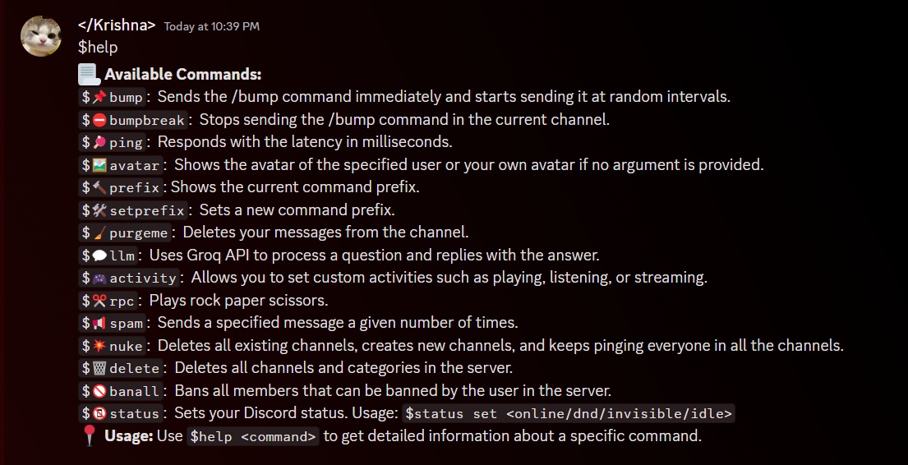

# Selfbot
## a Selfbot written in nodejs using "discord.js-selfbot-v13" library





## Instructions


 Edit .env.example to .env and add your discord token with the groq api for llm tasks
### NOTE: You will need a Groq api for llm functionality Get a free api key from [here](https://console.groq.com/keys)

<br>

### Installation 

```bash
npm install
```

### Code Execution

```bash
node index.js
```
